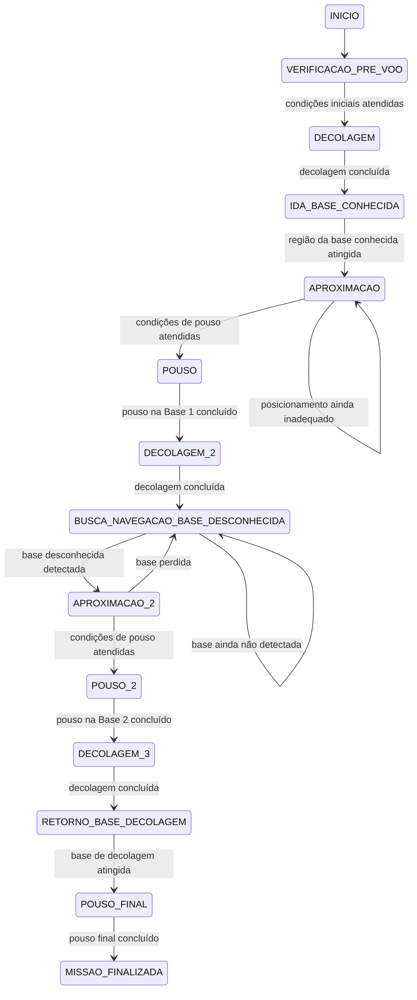

# Máquina de estados para missão 1 no Tello:
## Fluxograma

```mermaid
stateDiagram-v2

    INICIO --> VERIFICACAO_PRE_VOO

    VERIFICACAO_PRE_VOO --> DECOLAGEM: condições iniciais atendidas
    DECOLAGEM --> IDA_BASE_CONHECIDA: decolagem concluída

    IDA_BASE_CONHECIDA --> APROXIMACAO: região da base conhecida atingida
    APROXIMACAO --> POUSO: condições de pouso atendidas
    APROXIMACAO --> APROXIMACAO: posicionamento ainda inadequado

    POUSO --> DECOLAGEM_2: pouso na Base 1 concluído
    DECOLAGEM_2 --> BUSCA_NAVEGACAO_BASE_DESCONHECIDA: decolagem concluída

    BUSCA_NAVEGACAO_BASE_DESCONHECIDA --> BUSCA_NAVEGACAO_BASE_DESCONHECIDA: base ainda não detectada
    BUSCA_NAVEGACAO_BASE_DESCONHECIDA --> APROXIMACAO_2: base desconhecida detectada

    APROXIMACAO_2 --> POUSO_2: condições de pouso atendidas
    APROXIMACAO_2 --> BUSCA_NAVEGACAO_BASE_DESCONHECIDA: base perdida

    POUSO_2 --> DECOLAGEM_3: pouso na Base 2 concluído
    DECOLAGEM_3 --> RETORNO_BASE_DECOLAGEM: decolagem concluída

    RETORNO_BASE_DECOLAGEM --> POUSO_FINAL: base de decolagem atingida
    POUSO_FINAL --> MISSAO_FINALIZADA: pouso final concluído
```
