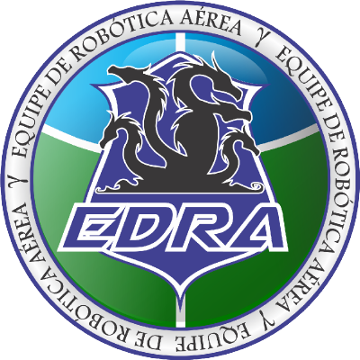
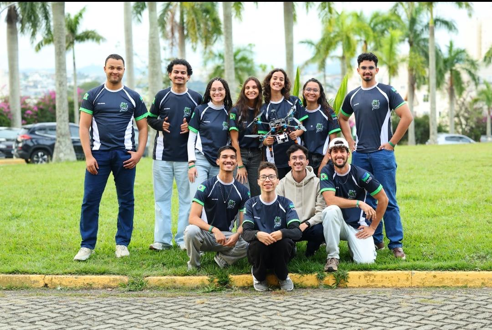

---
hide:
  - navigation
  - toc
---

# EdraWiki

O hub central de documentação técnica da EDRA — Equipe de Robótica Aérea da UnB.
Guias, tutoriais e conhecimento da equipe, num só lugar de fácil acesso.

[Primeiros passos](primeiros-passos.md){ .md-button .md-button--primary }
[Mapa da Documentação](mapa-da-documentacao.md){ .md-button }
[Como contribuir](contribuir.md){ .md-button }

<figure class="edra-team" markdown>

<figcaption>Equipe de Robótica Aérea — EDRA / UnB</figcaption>
</figure>

## Por onde começar

!!! tip "Primeira vez aqui?"
    A página [**Primeiros passos**](primeiros-passos.md) tem um fluxograma que te leva
    direto para o guia certo, na ordem certa. Os cards abaixo são para navegação livre
    por tema.

- :material-sign-direction:{ .lg } **[Primeiros passos](primeiros-passos.md)**

    ---

    Não sabe por onde começar? Comece aqui — a trilha completa, passo a passo.

- :material-map-search:{ .lg } **[Mapa da Documentação](mapa-da-documentacao.md)**

    ---

    O índice de tudo. Aponta para toda a documentação que existe nos 53
    repositórios da organização, organizada por tema.

- :material-download:{ .lg } **[Setup e Instalação](setup/index.md)**

    ---

    Como preparar o ambiente: PX4, ROS 2, Gazebo, Docker e a ponte uXRCE-DDS.

- :material-quadcopter:{ .lg } **[Simulação CBR2025](simulacao/cbr2025-arena-missao1.md)**

    ---

    Passo a passo completo da arena + missão de detecção/pouso (PX4 + Gazebo +
    ROS 2), com todos os problemas e soluções.

- :material-drone:{ .lg } **[Controle e Offboard](controle/index.md)**

    ---

    Controle externo do PX4 via ROS 2, modo Offboard e a diferença entre controlar
    por posição e por velocidade.

- :material-eye:{ .lg } **[Visão Computacional](visao/index.md)**

    ---

    Datasets, treinamento de modelos, detecção de bases e inferência embarcada.

- :material-raspberry-pi:{ .lg } **[Hardware / Raspberry](hardware/index.md)**

    ---

    Computadores de bordo (RPi 5), câmeras e bancadas de teste.

- :material-hand-heart:{ .lg } **[Como contribuir](contribuir.md)**

    ---

    Adicionar uma página é simples: escreva em markdown e abra um PR. Ao dar
    merge, o site publica sozinho.

---

!!! tip "Sobre este site"
    A EdraWiki é a **contraparte técnica** do
    [EdraDocs](https://edra-unb-fga.github.io/EdraDocs/) (o site institucional da
    equipe). A estratégia é **mapear e centralizar aos poucos**: o
    [Mapa da Documentação](mapa-da-documentacao.md) já aponta para tudo que existe
    hoje; o conteúdo vai sendo migrado para cá conforme for revisado.
