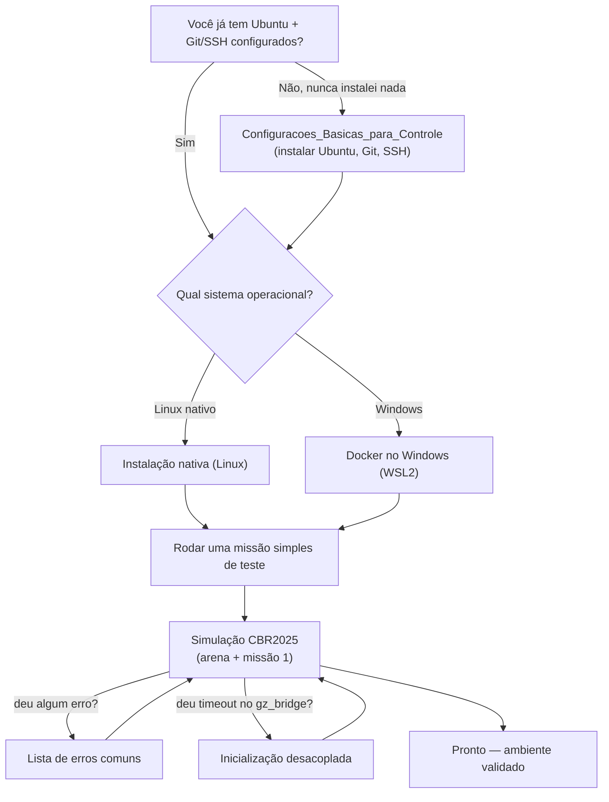

# Primeiros passos

Esta página existe para responder uma pergunta simples: **"por onde eu começo?"** — e
evitar que você leia quatro guias diferentes tentando descobrir qual serve pro seu caso.

A EdraWiki tem vários guias que fazem coisas parecidas (subir a simulação) de formas
diferentes, porque servem situações diferentes. Siga o fluxo abaixo em ordem.

---

## 1. Descubra seu ponto de partida

!!! tip "As caixas acima são só visuais"
    Os links de verdade estão na lista abaixo, na mesma ordem do fluxograma.

---

## 2. A trilha em texto (a mesma coisa, passo a passo)

1. **Nunca configurou o sistema?** Comece pelo tutorial de onboarding
   [Configuracoes_Basicas_para_Controle](https://github.com/edra-unb-fga/Configuracoes_Basicas_para_Controle)
   (instalar Ubuntu, configurar Git/SSH). Se já tem isso pronto, pule para o passo 2.

2. **Instale o ambiente de simulação**, escolhendo pelo seu sistema operacional:
      - Linux → [Instalação nativa (Linux)](setup/instalacao-nativa.md)
      - Windows → [Docker no Windows (WSL2)](setup/docker-windows.md)

    Escolha **um dos dois** — eles fazem a mesma coisa por caminhos diferentes, não é
    necessário seguir os dois. Os dois já incluem a instalação da ponte PX4 ↔ ROS 2
    (uXRCE-DDS) — não é preciso fazer isso separadamente. A página
    [Ponte uXRCE-DDS](setup/uxrce-dds.md) existe como referência caso precise entender
    ou reinstalar só essa parte depois.

3. **Rode a arena e a missão de teste da CBR2025**:
   [Simulação CBR2025 — Arena + Missão 1](simulacao/cbr2025-arena-missao1.md).
   Esse guia já assume que o passo 2 foi feito.

4. **Se algo travar:**
      - Erro de build, de comunicação PX4/ROS2/Gazebo, ou da ponte uXRCE →
        [Lista de erros comuns](simulacao/erros-comuns.md).
      - O `gz_bridge` trava em *timeout* esperando o mundo carregar →
        [Inicialização desacoplada](simulacao/inicializacao-desacoplada.md) (é um
        procedimento de contorno para esse sintoma específico, não um fluxo alternativo
        de uso geral).

5. **Depois que a simulação está rodando**, os guias abaixo são **material de
   referência** — consulte quando precisar, não é preciso ler em sequência:
      - [Controle e modo Offboard](controle/index.md) — como a lógica de voo funciona.
      - [Visão Computacional](visao/index.md) — gerar dataset e treinar o modelo de detecção.
      - [Hardware / Raspberry](hardware/index.md) — quando for para o drone físico.

---

!!! info "Não achou o que precisava?"
    O [Mapa da Documentação](mapa-da-documentacao.md) lista tudo que existe nos 53
    repositórios da organização, por tema.
